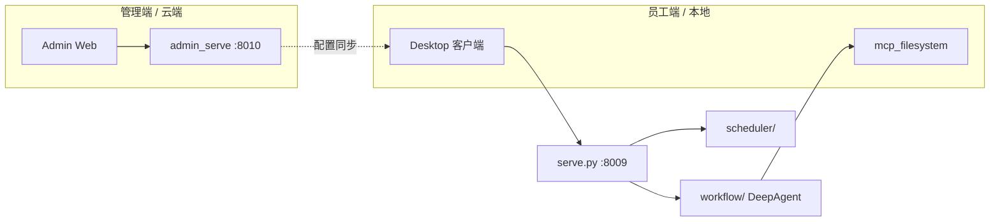
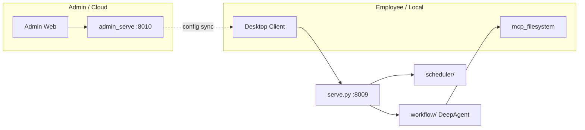

# Workmate

> 企业级 AI 智能体框架 · Enterprise AI Agent Platform  

**Language / 语言**: [中文](#中文) · [English](#english)

---

## 中文

### 【重要法律提示】使用前必读

Copyright (c) 2026 【上海兆碁供应链科技有限公司】

本项目依据 MIT 开源许可证分发，SPDX-License-Identifier: MIT，软件按原样 (AS-IS) 提供，不作任何明示或者暗示的担保，项目的使用、修改、商用、二次分发产生的一切风险、法律合规责任，全部由使用者自行承担。二次分发作品时，必须完整保留本条版权、许可以及免责声明。

外部开发者提交代码、分支、合并请求，即永久授予项目作者完整、不可撤销的授权：作者拥有全部分支管理权限，有权审核、拒绝、合并外部代码，并基于全部代码迭代发布后续所有版本。

查阅完整文档：[NOTICE.md](NOTICE.md)、[DISCLAIMER.md](DISCLAIMER.md)（完整免责声明）、[LICENSE](LICENSE)（MIT 许可原文）、[README.md](README.md)、[CONTRIBUTING.md](CONTRIBUTING.md)（贡献指南）

### 项目简介

**Workmate** 是面向供应链等复杂业务场景的新一代**企业级 AI 智能体框架**。它诞生于兆企供应链在塑料、化工等工业原材料领域的数字化实践，旨在帮助企业从「应用智能」走向「**驾驭智能**」——在保留现有 ERP/CRM/SCM 等遗留系统的前提下，以可控、可审计、可协同的方式落地 AI 生产力。

兆企供应链服务平台成立于 2021 年，运营总部在上海，服务数千家中小实体企业。Workmate 承载其「**科技创新、赋能供需、链接产业、服务实体**」的核心宗旨，将 AI 与企业管理规范、岗位权限、业务流程深度绑定，而非构建脱离组织的「全能黑盒 Agent」。

### 核心理念

| 概念 | 说明 |
|------|------|
| **人驭智能、人谋智行** | 每位员工拥有专属 Workmate 客户端；AI 权限严格映射员工岗位，关键决策必须人工确认 |
| **渐进式改造** | `企业 AI 升级 = Skills（管理规范）+ MCP（原系统工具化）`，无需推翻重建遗留系统 |
| **分布式智能体** | 管理端统一编排，员工端分布式执行；支持跨岗位、跨部门协同任务流转 |
| **跨组织协同** | 上下游企业采用同框架时，可建立安全的企业间协作网络 |
| **三层记忆** | 会话记忆（SQLite）+ 任务记忆（MySQL）+ 习惯记忆，按需加载，避免上下文膨胀 |
| **安全屏障** | 凭证集中管控、出站内容审查、工具白名单、全链路审计 |

### 主要能力

- **DeepAgent 工作流** — 流式 `/quotation` SSE API，支持 LangGraph 检查点与会话恢复
- **MCP 工具层** — 将企业原有系统功能封装为 AI 可调用的标准工具（60+ 内置工具）
- **Skills 技能包** — 将岗位制度、审批流程、权限边界固化为可执行的行为准则
- **子代理（Subagent）** — 复杂任务拆解为隔离上下文的专业子代理，避免单 Agent 记忆溢出
- **桌面客户端** — PyQt 内嵌 SPA，登录即用，自动同步 MCP/Skills/协同/定时任务
- **管理端** — 组织架构、权限、大模型、Skills 审批、知识库、安全规则统一管控
- **调度器** — 定时任务与执行追踪
- **微信 / 企微** — 未读消息处理、联系人专属聊天模式、企微机器人远程触发
- **协同任务** — 跨岗位工作流：分析 → 确认 → 建链 → 逐步流转 → 全局可见

### 典型应用场景

1. **大宗订单跨岗协同链** — 业务员上传合同 → 主管比对审批 → 财务/法务审查 → 自动生成采购订单  
2. **业务员微信智能回复** — 读取未读与历史上下文 → 按联系人档案拟稿 → 关键承诺人工确认 → 持续沉淀聊天模式  
3. **出站消息安全拦截** — 关键词黑名单 + 企业保密规则 + LLM 隐晦语义审查，拦截可审计  

更多业务背景与赋能效果，参见兆企《WorkMate 应用白皮书》。

### 系统架构



**部署模式**：云端管、本地运 — 管理端 Docker 部署，员工端 Windows `.exe` 一键安装，登录后静默同步配置。

### 快速开始

#### 环境要求

- Python **>= 3.12**
- [uv](https://docs.astral.sh/uv/)（推荐）或 pip
- Windows（桌面端与微信自动化）；后端也可在 Linux/macOS 运行

#### 1. 克隆与依赖

```bash
git clone <your-repo-url> workmate
cd workmate
uv sync
```

#### 2. 配置环境

```bash
cp .env.example .env
cp config/mcp_servers.example.json config/mcp_servers.json
cp config/mcp_operable_dirs.example.json config/mcp_operable_dirs.json
cp config/wechat.example.json config/wechat.json          # 可选：微信功能
cp config/skills_config.example.json config/skills_config.json
cp config/content_security_rules.example.json config/content_security_rules.json
cp config/scheduled_tasks.example.json config/scheduled_tasks.json
cp config/desktop_config.example.json config/desktop_config.json
```

编辑 `.env`，至少配置：

| 变量 | 说明 |
|------|------|
| `DASHSCOPE_API_KEY` / `DEEPSEEK_API_KEY` 等 | 大模型 API 密钥（由管理端统一配置时，员工端可不直接接触） |
| `WORKMATE_DB_*` | 任务记忆、习惯记忆等 MySQL 连接 |
| `MCP_READ_ALLOWED_DIRS` / `MCP_WRITE_ALLOWED_DIRS` | MCP 文件读写白名单 |

#### 3. 启动后端

```bash
python serve.py
```

- 默认地址：`http://127.0.0.1:8009`
- 健康检查：`GET /agent/health`
- 对话流式接口：`POST /quotation`（SSE）

#### 4. 启动管理端（可选）

```bash
uv run python admin_serve.py
```

管理端默认 `http://127.0.0.1:8010`。首次使用需在 `sys_admin_users` 等表中创建管理员账号（详见 `admin_api`）。

Docker 一键部署：

```bash
cp .env.admin.example .env
docker compose -f docker-compose.admin.yml up --build
```

详见 [Docker发布指南.md](Docker发布指南.md)、[管理端安装说明-Docker.md](管理端安装说明-Docker.md)。

#### 5. 启动桌面客户端（可选）

```bash
uv sync --group desktop
uv run --group desktop python -m desktop.webview_shell
```

桌面端会自动拉起 `serve.py`（若未运行），登录后同步 Skills、MCP、协同与定时任务。详见 [desktop/README.md](desktop/README.md)、[docs/admin-desktop-integration.md](docs/admin-desktop-integration.md)。

### 日常使用

| 场景 | 操作 |
|------|------|
| **网页/桌面聊天** | 打开桌面客户端 → 登录 → 输入任务 → 流式查看 Agent 回复 |
| **CLI 单次调用** | `python main.py` 或按 `main.py` 中示例传入参数 |
| **定时任务** | 管理端或 `config/scheduled_tasks.json`（本地，已 gitignore）配置 |
| **协同任务** | 桌面端任务输入框发起 → 人机确认协作者 → 自动建链并逐步流转 |
| **微信模式** | 配置 `config/wechat.json` → 在 `skills/wechat-mode/references/` 维护联系人档案（参考 `example-contact.md`） |
| **Skills 开发** | 在 `skills/` 下编写 SKILL.md → 管理端审批后分发给员工端 |
| **MCP 扩展** | 编辑 `config/mcp_servers.json`，将原系统 API 注册为 MCP 工具 |

### 配置说明

| 文件 | 用途 |
|------|------|
| [`.env.example`](.env.example) | 运行时环境变量模板 |
| [`.env.admin.example`](.env.admin.example) | Docker 管理端子集 |
| [`config/mcp_servers.example.json`](config/mcp_servers.example.json) | MCP 服务定义模板（复制为 `mcp_servers.json`） |
| [`config/mcp_operable_dirs.example.json`](config/mcp_operable_dirs.example.json) | MCP 读写目录白名单模板 |
| [`config/subagents.json`](config/subagents.json) | 子代理定义 |
| [`config/wechat.example.json`](config/wechat.example.json) | 微信 Agent 默认配置 |
| [`config/skills_config.example.json`](config/skills_config.example.json) | 各 Skill 启用开关 |
| [`config/content_security_rules.example.json`](config/content_security_rules.example.json) | 出站内容安全规则 |
| [`config/scheduled_tasks.example.json`](config/scheduled_tasks.example.json) | 定时任务本地存储模板 |
| [`config/desktop_config.example.json`](config/desktop_config.example.json) | 桌面客户端运行参数模板 |
| [`config/task_executions.example.json`](config/task_executions.example.json) | 定时任务执行记录初始空文件 |
| [`config/desktop_scheduler_feed.example.json`](config/desktop_scheduler_feed.example.json) | 桌面侧栏定时任务 feed 初始空文件 |

**安全提示**：切勿提交 `.env`、微信缓存、个人联系人档案；生产环境务必修改默认管理员密码并轮换所有 API 密钥。

### 开发与贡献

```bash
pytest
python serve.py
```

- 贡献指南：[CONTRIBUTING.md](CONTRIBUTING.md)
- 工程规范：[CLAUDE.md](CLAUDE.md)

### 许可证

本项目采用 [MIT License](LICENSE)。合规补充文件：[NOTICE.md](NOTICE.md)、[DISCLAIMER.md](DISCLAIMER.md)。

- `admin_web_v/` 基于 [Vben Admin](admin_web_v/LICENSE)（MIT）
- `skills/` 子目录可能包含独立 LICENSE 文件

---

## English

### Important legal notice

Copyright (c) 2026 Shanghai Zhaoqi Supply Chain Technology Co., Ltd.

This project is distributed under the MIT License (SPDX-License-Identifier: MIT). The software is provided AS-IS without warranty. All risks and legal compliance obligations from use, modification, commercial use, or redistribution are borne by the user. Redistributions must retain the copyright notice, license, and disclaimer references.

By submitting code, branches, or pull requests, external contributors grant the project maintainers a perpetual, irrevocable license to manage branches and release subsequent versions.

Full documents: [NOTICE.md](NOTICE.md), [DISCLAIMER.md](DISCLAIMER.md), [LICENSE](LICENSE), [CONTRIBUTING.md](CONTRIBUTING.md).

### Overview

**Workmate** is an **enterprise-grade AI agent framework** designed for complex industries such as supply chain management. Born from Zhaoqi Supply Chain’s digital practice in plastics and chemicals, it helps organizations move from “using AI” to **“governing AI”** — deploying AI productivity in a controllable, auditable, and collaborative way **without replacing existing ERP/CRM/SCM systems**.

Workmate embodies the principle of **human-guided intelligence**: every employee gets a dedicated client; agent permissions mirror job roles; critical decisions require human approval.

### Core Concepts

| Concept | Description |
|---------|-------------|
| **Human-guided AI** | Per-employee Workmate client; strict permission mapping; human-in-the-loop at risk points |
| **Incremental modernization** | `Enterprise AI = Skills (policies) + MCP (legacy tool wrapping)` — no rip-and-replace |
| **Distributed agents** | Central admin orchestration + local employee execution; cross-role collaboration chains |
| **Cross-org collaboration** | Secure inter-company workflows when partners use the same framework |
| **Three-layer memory** | Session (SQLite) + task (MySQL) + habit memory — loaded on demand |
| **Security barrier** | Centralized credentials, outbound content review, tool allowlists, full audit trail |

### Key Capabilities

- **DeepAgent workflows** — streaming `/quotation` SSE with LangGraph checkpoints
- **MCP tool layer** — wrap legacy systems as standard AI-callable tools (60+ built-ins)
- **Skills** — encode SOPs, approval flows, and permission boundaries as executable rules
- **Subagents** — isolate context for complex subtasks; prevent single-agent context overflow
- **Desktop client** — PyQt shell; login-and-go; auto-sync of MCP, Skills, collab, and schedules
- **Admin console** — org structure, permissions, models, Skill approval, knowledge base, security
- **Scheduler** — cron-style automation with execution tracking
- **WeChat / WeChat Work** — unread handling, per-contact chat profiles, bot remote trigger
- **Collaboration tasks** — multi-step cross-role workflows with real-time visibility

### Typical Use Cases

1. **Bulk order approval chain** — sales upload → manager review → finance/legal → auto PO  
2. **WeChat smart replies** — context-aware drafts per contact profile → human confirm on commitments  
3. **Outbound message guardrails** — keyword blocklist + custom rules + LLM semantic review  

### Architecture



**Deployment model**: cloud-managed, locally executed — Docker admin + Windows desktop installer.

### Quick Start

#### Requirements

- Python **>= 3.12**
- [uv](https://docs.astral.sh/uv/) (recommended) or pip
- Windows for desktop & WeChat automation; backend also runs on Linux/macOS

#### 1. Clone & install

```bash
git clone <your-repo-url> workmate
cd workmate
uv sync
```

#### 2. Configure

```bash
cp .env.example .env
cp config/mcp_servers.example.json config/mcp_servers.json
cp config/mcp_operable_dirs.example.json config/mcp_operable_dirs.json
cp config/wechat.example.json config/wechat.json          # optional
cp config/skills_config.example.json config/skills_config.json
cp config/content_security_rules.example.json config/content_security_rules.json
cp config/scheduled_tasks.example.json config/scheduled_tasks.json
cp config/desktop_config.example.json config/desktop_config.json
```

Edit `.env` — at minimum set LLM API keys (`DASHSCOPE_API_KEY`, etc.) and `WORKMATE_DB_*` if using memory features.

#### 3. Start backend

```bash
python serve.py
```

- Default: `http://127.0.0.1:8009`
- Health: `GET /agent/health`
- Chat SSE: `POST /quotation`

#### 4. Start admin (optional)

```bash
uv run python admin_serve.py
```

Or via Docker — see [Docker发布指南.md](Docker发布指南.md) (Chinese deployment guide).

#### 5. Start desktop (optional)

```bash
uv sync --group desktop
uv run --group desktop python -m desktop.webview_shell
```

See [desktop/README.md](desktop/README.md) and [docs/admin-desktop-integration.md](docs/admin-desktop-integration.md).

### Daily Usage

| Scenario | How |
|----------|-----|
| **Desktop chat** | Launch client → sign in → type task → stream Agent response |
| **CLI** | `python main.py` |
| **Scheduled tasks** | Configure via admin or local `scheduled_tasks.json` (gitignored) |
| **Collaboration** | Initiate from desktop task box → confirm assignees → auto chain execution |
| **WeChat mode** | Configure `config/wechat.json` + contact profiles under `skills/wechat-mode/references/` |
| **Skills** | Author under `skills/` → approve in admin → distribute to clients |
| **MCP extensions** | Edit `config/mcp_servers.json` to register legacy APIs as tools |

### Configuration

| File | Purpose |
|------|---------|
| [`.env.example`](.env.example) | Runtime env template |
| [`.env.admin.example`](.env.admin.example) | Admin/Docker subset |
| [`config/mcp_servers.example.json`](config/mcp_servers.example.json) | MCP server template (copy to `mcp_servers.json`) |
| [`config/mcp_operable_dirs.example.json`](config/mcp_operable_dirs.example.json) | MCP path allowlist template |
| [`config/subagents.json`](config/subagents.json) | Subagent definitions |
| [`config/wechat.example.json`](config/wechat.example.json) | WeChat agent defaults |
| [`config/skills_config.example.json`](config/skills_config.example.json) | Per-skill toggles |
| [`config/content_security_rules.example.json`](config/content_security_rules.example.json) | Outbound security rules |
| [`config/scheduled_tasks.example.json`](config/scheduled_tasks.example.json) | Scheduled tasks local storage template |
| [`config/desktop_config.example.json`](config/desktop_config.example.json) | Desktop client runtime template |
| [`config/task_executions.example.json`](config/task_executions.example.json) | Empty task execution history seed |
| [`config/desktop_scheduler_feed.example.json`](config/desktop_scheduler_feed.example.json) | Empty desktop scheduler feed seed |

**Security**: Never commit `.env`, WeChat caches, or personal contact profiles. Rotate credentials and change default admin passwords in production.

### Development

```bash
pytest
python serve.py
```

- [CONTRIBUTING.md](CONTRIBUTING.md)
- [CLAUDE.md](CLAUDE.md) (engineering conventions)

### License

[MIT License](LICENSE). Supplementary compliance: [NOTICE.md](NOTICE.md), [DISCLAIMER.md](DISCLAIMER.md). Third-party: Vben Admin (`admin_web_v/`, MIT); individual Skills may have their own LICENSE files.
